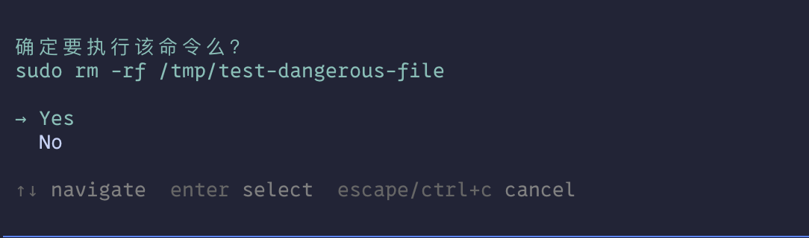
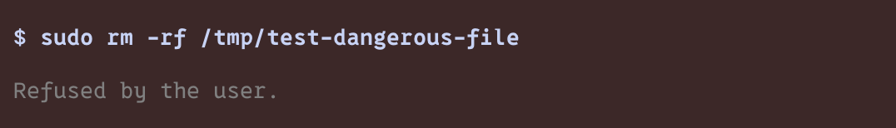

# Pi Agent File Protection / Pi Agent 文件保护

A Pi extension that protects your files and system from accidental destructive operations.

一个保护您的文件和系统免受意外破坏操作的 Pi 扩展。

<table>
<tr>
<td></td>
<td></td>
</tr>
</table>

## Features / 功能

### 🛡️ Shield Control / 保护盾控制 (`/shield`)

Use the `/shield` command to toggle protection for the current session or configure the default state for future sessions.

使用 `/shield` 命令切换当前会话的保护状态，或配置未来会话的默认状态。

```bash
/shield                 # Open interactive shield settings panel / 打开交互式设置面板
/shield on              # Enable shield for current session / 当前会话开启保护
/shield off             # Disable shield for current session / 当前会话关闭保护
/shield default on      # Enable shield by default / 默认开启保护
/shield default off     # Disable shield by default / 默认关闭保护
```

The interactive panel supports toggling:

交互式面板支持切换：

- Current session shield state / 当前会话保护状态
- Default shield state for future sessions / 未来会话默认保护状态

Default configuration is stored at:

默认配置保存于：

```text
~/.pi/agent/pi-file-protection.json
```

### ⌨️ Shortcut / 快捷键

```text
Ctrl+Shift+S
```

Toggle the shield for the current session without changing the default configuration.

切换当前会话的保护状态，不影响默认配置。

### 🎨 Editor Status / 输入框状态显示

The shield state is shown directly in the editor border:

保护状态会直接显示在输入框边框上：

```text
[ SHIELD ON  ]
[ SHIELD OFF ]
```

The status label uses a subtle animated color effect:

状态标签带有轻微的颜色动效：

- `SHIELD ON` — restrained blue tones / 蓝色系
- `SHIELD OFF` — restrained red tones / 红色系

### 📢 OS Notifications / 系统通知

- **Permission requests** — macOS notification pops up when a protected operation needs your approval (✏️ for file edits, 📟 for bash commands)
- **Agent completion** — macOS notification with a summary of the last response when the agent finishes
- **Operation details** — notification content includes file paths, commands, and other request details

- **权限请求** — 受保护操作需要确认时弹出 macOS 系统通知（✏️ 表示文件编辑，📟 表示 bash 命令）
- **Agent 完成** — agent 回复完毕后弹出 macOS 系统通知，附带回复摘要
- **操作详情** — 通知内容包含文件路径、命令等请求信息

### Git & GitHub CLI Protection / Git 与 GitHub CLI 保护
Prompts for confirmation before executing blacklisted `git` commands, and before executing any `gh` commands.
执行黑名单中的 `git` 命令前会要求确认，并且执行任何 `gh` 命令前也会要求确认。

### Delete Protection / 删除保护
Prompts for confirmation before running destructive commands like `rm`, `rmdir`, `unlink`, `mv`, or any command containing "delete" (e.g., `find -delete`, `kubectl delete`).
执行破坏性命令（如 `rm`、`rmdir`、`unlink`、`mv`）或包含 "delete" 的命令（如 `find -delete`、`kubectl delete`）前会要求确认。

### Edit Protection / 编辑保护
Prompts for confirmation before:
- Using `write` or `edit` tools
- Running bash commands like `truncate`, `sed -i`, or output redirection (`>`, `>>`)

在以下操作前会要求确认：
- 使用 `write` 或 `edit` 工具
- 运行 bash 命令如 `truncate`、`sed -i` 或输出重定向（`>`、`>>`）

### Privilege Protection / 权限保护
Prompts for confirmation before:
- Running `sudo` commands (elevated privileges)
- Setting dangerous permissions with `chmod/chown 777`

在以下操作前会要求确认：
- 运行 `sudo` 命令（提升权限）
- 使用 `chmod/chown 777` 设置危险权限

## Installation / 安装

**推荐方式 (Recommended):**
```bash
pi install npm:pi-file-protection
```

**从源码安装 (From source):**
```bash
pi install git:github.com/rUrU516/pi-file-protection
```

## Update / 更新

To get the latest features and protections:

获取最新功能和保护：

```bash
pi update
```

## Usage / 使用

Once installed, the extension automatically activates and will prompt you for confirmation before executing any protected operations.

安装后，扩展会自动激活，并在执行任何受保护的操作前提示您确认。

## License / 许可证

MIT
