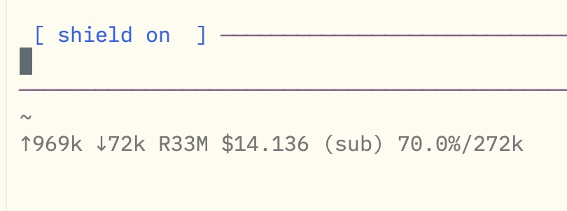
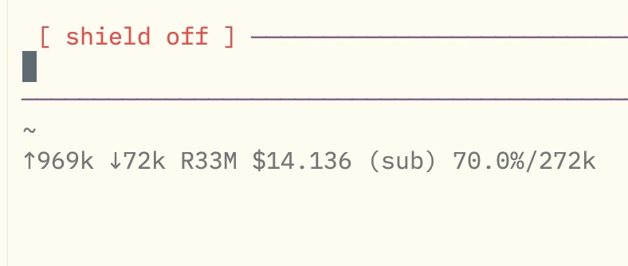
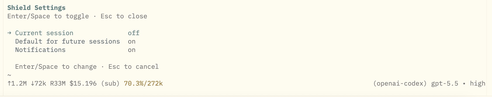

# Pi Shield

A Pi extension that asks for confirmation before risky file, git, bash, and privilege operations.

## Install

```bash
pi install npm:pi-shield
```

## UI

Shield status lives in the editor border.

<table>
<tr>
<td></td>
<td></td>
</tr>
</table>

Settings panel:



## Commands

```bash
/shield
/shield on
/shield off
/shield default on
/shield default off
/shield notifications on
/shield notifications off
```

- `/shield` opens the settings panel.
- `/shield on/off` changes the current session only.
- `/shield default on/off` changes the default for future sessions.
- `/shield notifications on/off` toggles macOS notifications globally.

## Shortcut

```text
Ctrl+Shift+S
```

Toggles the shield for the current session.

## Protects

- `write` and `edit` tool calls
- destructive bash commands like `rm`, `mv`, `delete`
- risky git / GitHub CLI commands
- privilege commands like `sudo` and `chmod 777`

## Notifications

macOS notifications are shown for permission requests and agent completion.

They can be disabled from `/shield` or with:

```bash
/shield notifications off
```

## Config

```text
~/.pi/agent/pi-shield.json
```

## License

MIT
